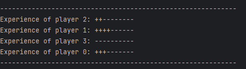

## progress-bars
This is an example of a progress bar implementation with dynamic multithreaded updating.

Advantages of this solution:
- Aimed at performance and minimizing operations for drawing a progress bar & I/O operations
- Allows you to specify different sources of information for the progress bar
- Allows you to configure the displayed characters for a "filled" and "empty" cell
- Automatically performs calculations based on dynamic configuration data

**WARNING!** This is not a **"ready to use"** solution, it is the basis for developing your own progress bar.

Example of use:

